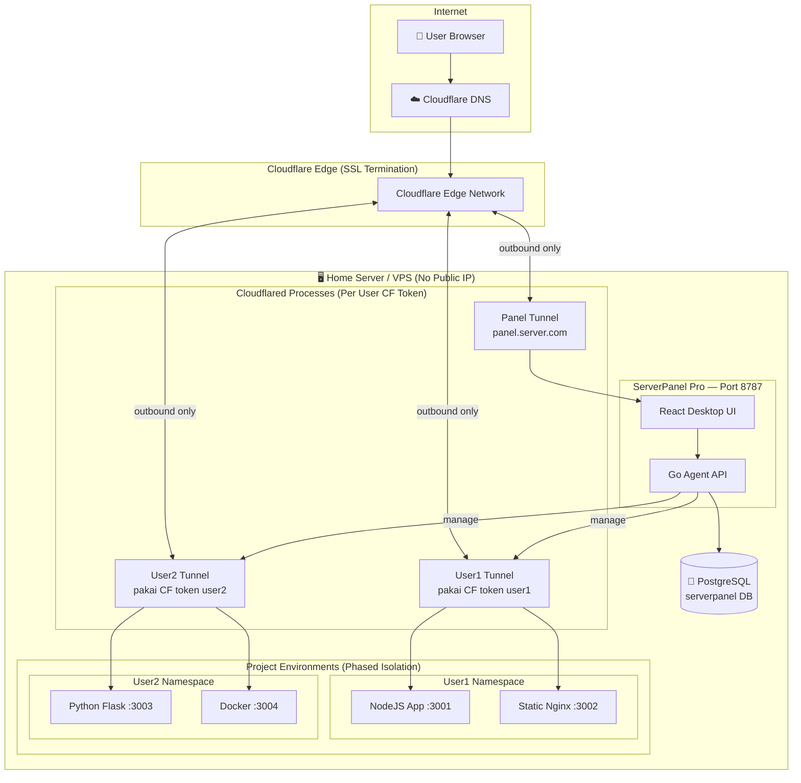

# 🚀 ServerPanel Pro — Implementation Plan (FINAL)

> Status: **APPROVED — Ready for Execution**
> Semua keputusan arsitektur sudah dikonfirmasi.

---

## Keputusan Arsitektur (Confirmed)

| Topik | Keputusan |
|-------|-----------|
| Auth ENV fallback | ❌ Dihapus — full migrasi ke database |
| Cloudflare Account | 👤 Per-user (masing-masing user input token CF sendiri) |
| Isolasi Proses | 📈 Bertahap: Data/API level → OS-level per tenant |
| Subdomain Panel | `{generated}.{main-server-domain}` untuk manajemen internal |
| Subdomain Project | Bebas — user pakai domain milik mereka + token CF sendiri |
| Registrasi User | 📈 Bertahap: Admin-only → Self-service + Payment |
| Database Engine | 🐘 **Migrasi ke PostgreSQL** |

---

## ERD Final — Entity Relationship Diagram

```mermaid
erDiagram
    USERS {
        bigserial id PK
        varchar(80) username UK
        varchar(254) email UK
        text password_hash
        varchar(20) role "superadmin|admin|user"
        varchar(20) status "active|suspended|pending"
        varchar(120) display_name
        text avatar_url
        timestamp created_at
        timestamp updated_at
        timestamp last_login_at
    }

    USER_SESSIONS {
        bigserial id PK
        bigint user_id FK
        varchar(128) token UK
        varchar(64) ip_address
        text user_agent
        timestamp expires_at
        timestamp created_at
    }

    USER_QUOTAS {
        bigserial id PK
        bigint user_id FK "UNIQUE"
        int max_projects
        int max_tunnels
        bigint disk_quota_mb
        int cpu_limit_percent
        int memory_limit_mb
        timestamp created_at
        timestamp updated_at
    }

    USER_CLOUDFLARE_CONFIGS {
        bigserial id PK
        bigint user_id FK "UNIQUE"
        text api_token_encrypted
        varchar(64) account_id
        varchar(64) zone_id
        varchar(253) base_domain
        varchar(20) status "active|invalid|unconfigured"
        timestamp verified_at
        timestamp created_at
        timestamp updated_at
    }

    USER_PREFERENCES {
        bigint user_id PK FK
        jsonb wallpaper_data
        jsonb theme_settings
        timestamp updated_at
    }

    PROJECTS {
        bigserial id PK
        bigint user_id FK
        varchar(80) name
        varchar(80) slug
        text description
        varchar(30) status "active|stopped|building|error|draft"
        varchar(30) project_type "static|nodejs|python|php|docker|proxy|custom"
        varchar(500) repo_url
        text working_dir
        integer exposed_port
        integer assigned_port
        timestamp created_at
        timestamp updated_at
    }

    PROJECT_ENV_VARS {
        bigserial id PK
        bigint project_id FK
        varchar(128) key
        text value_encrypted
        boolean is_secret
        timestamp created_at
        timestamp updated_at
    }

    PROJECT_DEPLOYMENTS {
        bigserial id PK
        bigint project_id FK
        bigint triggered_by FK
        varchar(64) commit_hash
        varchar(20) status "pending|building|success|failed|rollback"
        text build_log
        timestamp started_at
        timestamp finished_at
        timestamp created_at
    }

    TUNNELS {
        bigserial id PK
        bigint user_id FK
        bigint project_id FK "nullable"
        varchar(120) name
        text target_url
        varchar(20) status "active|inactive|error|pending|creating"
        varchar(128) cf_tunnel_id
        varchar(253) cf_hostname
        jsonb tunnel_config
        timestamp created_at
        timestamp updated_at
    }

    TUNNEL_LOGS {
        bigserial id PK
        bigint tunnel_id FK
        varchar(10) level "info|warn|error"
        text message
        jsonb metadata
        timestamp created_at
    }

    DOMAIN_RECORDS {
        bigserial id PK
        bigint user_id FK
        bigint tunnel_id FK "nullable"
        varchar(253) hostname UK
        boolean ssl_enabled
        varchar(20) status "active|pending|error|verifying"
        text verification_token
        timestamp verified_at
        timestamp created_at
        timestamp updated_at
    }

    DOCKER_SERVICES {
        bigserial id PK
        bigint user_id FK
        bigint project_id FK "nullable"
        varchar(128) container_id
        varchar(128) container_name
        text image
        jsonb ports
        jsonb env_vars
        jsonb volumes
        varchar(20) status "running|stopped|error|creating"
        timestamp created_at
        timestamp updated_at
    }

    RUNTIME_LOGS {
        bigserial id PK
        varchar(80) service
        bigint user_id FK "nullable"
        bigint project_id FK "nullable"
        varchar(10) level
        text message
        jsonb metadata
        timestamp created_at
    }

    CHANGELOG_ENTRIES {
        bigserial id PK
        varchar(32) version
        varchar(190) title
        text summary
        varchar(32) released_at
        timestamp created_at
    }

    SETTINGS_AUDIT {
        bigserial id PK
        bigint user_id FK
        varchar(253) hostname
        varchar(80) timezone
        jsonb nameservers
        timestamp created_at
    }

    TERMINAL_PRESETS {
        bigserial id PK
        bigint user_id FK "nullable = global preset"
        varchar(190) label
        text command
        integer sort_order
        boolean is_global
        timestamp created_at
    }

    NOTIFICATIONS {
        bigserial id PK
        bigint user_id FK
        varchar(190) title
        text body
        varchar(20) type "info|success|warning|error"
        boolean is_read
        text action_url
        timestamp created_at
    }

    WEBHOOK_CONFIGS {
        bigserial id PK
        bigint project_id FK
        varchar(128) secret_token UK
        varchar(20) target_event "push|deploy|any"
        boolean active
        timestamp created_at
    }

    PAYMENT_PLANS {
        bigserial id PK
        varchar(80) name
        varchar(30) slug UK
        integer max_projects
        integer max_tunnels
        bigint disk_quota_mb
        integer price_idr
        boolean active
        timestamp created_at
    }

    %% Relations
    USERS ||--o{ USER_SESSIONS : "has"
    USERS ||--o| USER_QUOTAS : "owns"
    USERS ||--o| USER_CLOUDFLARE_CONFIGS : "configures"
    USERS ||--o| USER_PREFERENCES : "has"
    USERS ||--o{ PROJECTS : "owns"
    USERS ||--o{ TUNNELS : "owns"
    USERS ||--o{ DOMAIN_RECORDS : "owns"
    USERS ||--o{ DOCKER_SERVICES : "owns"
    USERS ||--o{ NOTIFICATIONS : "receives"
    USERS ||--o{ TERMINAL_PRESETS : "creates"
    USERS ||--o{ SETTINGS_AUDIT : "performs"
    PROJECTS ||--o{ PROJECT_ENV_VARS : "has"
    PROJECTS ||--o{ PROJECT_DEPLOYMENTS : "has"
    PROJECTS ||--o{ WEBHOOK_CONFIGS : "has"
    PROJECTS ||--o{ TUNNELS : "exposed via"
    TUNNELS ||--o{ TUNNEL_LOGS : "generates"
    TUNNELS ||--o{ DOMAIN_RECORDS : "used by"
    PROJECT_DEPLOYMENTS }o--|| USERS : "triggered by"
    USERS }o--o| PAYMENT_PLANS : "subscribed to"
```

---

## Arsitektur Sistem



---

## Proposed Changes — File-by-File

### 🗄️ Database Layer

#### [MODIFY] `internal/database/database.go`
- Ganti driver MySQL (`go-sql-driver/mysql`) → PostgreSQL (`lib/pq` atau `pgx`)
- Tambahkan 13 tabel baru dalam `ensureSchema()`
- Tambahkan CRUD methods untuk semua entitas baru

#### [NEW] `internal/database/migrations/`
- Migration system berbasis versi (file SQL per versi)
- Auto-run pada startup

---

### 🔐 Auth Layer

#### [MODIFY] `internal/auth/auth.go`
- Hapus single-user hardcoded logic
- Ganti ke DB-backed multi-user dengan bcrypt
- Session store di tabel `user_sessions` (persistent)
- Tambahkan role-based access control (RBAC)

#### [MODIFY] `internal/config/config.go`
- Hapus `PANEL_ADMIN_USERNAME` / `PANEL_ADMIN_PASSWORD`
- Tambahkan `PANEL_ENCRYPTION_KEY` (untuk enkripsi CF tokens)
- Tambahkan `PANEL_BASE_DOMAIN` (domain utama panel)
- Migrasi DB config ke PostgreSQL DSN

---

### 👤 Users Module

#### [NEW] `internal/users/users.go`
- CRUD users + bcrypt hashing
- Quota management
- Role management

#### [NEW] `internal/users/cloudflare.go`
- Store/retrieve CF token terenkripsi per user
- Verify token ke Cloudflare API

---

### ☁️ Cloudflare Module

#### [NEW] `internal/cloudflare/api.go`
- Cloudflare API client (per user token)
- Create/Delete tunnel via API
- Create/Delete DNS record

#### [NEW] `internal/cloudflare/daemon.go`
- Start/stop `cloudflared tunnel run` process per user
- Process lifecycle manager
- Health check + auto-restart

#### [NEW] `internal/cloudflare/config.go`
- Generate `config.yml` untuk tiap tunnel
- Ingress rules management

---

### 📦 Projects Module

#### [NEW] `internal/projects/projects.go`
- CRUD projects
- Port auto-allocation per user range
- Project status management

#### [NEW] `internal/projects/runner.go`
- Start/stop project process
- Process manager (per project type: node, python, php, static)
- Resource monitoring

#### [NEW] `internal/projects/deploy.go`
- Deploy pipeline
- Build command execution
- Log streaming via WebSocket

---

### 🌐 HTTP Server

#### [MODIFY] `internal/httpserver/server.go`
- Tambahkan semua API route baru (lihat tabel di bawah)
- Middleware role-check (requireRole)
- Middleware user-scoping (inject userID ke context)

---

### 🖥️ Frontend

#### [MODIFY] `src/App.tsx`
- Role-based window routing
- User context global state

#### [NEW] `src/components/windows/UsersWindow.tsx`
#### [NEW] `src/components/windows/ProjectsWindow.tsx`
#### [NEW] `src/components/windows/TunnelsWindow.tsx`
#### [NEW] `src/components/windows/DomainsWindow.tsx`
#### [NEW] `src/components/windows/ProfileWindow.tsx`
#### [MODIFY] `src/components/windows/LoginScreen.tsx`
#### [MODIFY] `src/components/windows/SettingsWindow.tsx`

---

## API Endpoints Lengkap

```
AUTH
POST   /api/v1/auth/login                    # Login
POST   /api/v1/auth/logout                   # Logout
GET    /api/v1/me                            # Info user + role + CF status

USERS (admin/superadmin)
GET    /api/v1/users                         # List users
POST   /api/v1/users                         # Buat user baru
GET    /api/v1/users/{id}                    # Detail user
PATCH  /api/v1/users/{id}                    # Update user
DELETE /api/v1/users/{id}                    # Hapus user
POST   /api/v1/users/{id}/suspend            # Suspend
POST   /api/v1/users/{id}/activate           # Aktifkan
GET    /api/v1/users/{id}/quota              # Lihat quota
PATCH  /api/v1/users/{id}/quota              # Edit quota

CLOUDFLARE (per user)
GET    /api/v1/me/cloudflare                 # Status CF config user
POST   /api/v1/me/cloudflare                 # Set/update CF token + zone
DELETE /api/v1/me/cloudflare                 # Hapus CF config
POST   /api/v1/me/cloudflare/verify          # Verifikasi token CF

PROJECTS
GET    /api/v1/projects                      # List projects user
POST   /api/v1/projects                      # Buat project
GET    /api/v1/projects/{id}                 # Detail project
PATCH  /api/v1/projects/{id}                 # Update project
DELETE /api/v1/projects/{id}                 # Hapus project
POST   /api/v1/projects/{id}/start           # Start project
POST   /api/v1/projects/{id}/stop            # Stop project
POST   /api/v1/projects/{id}/deploy          # Trigger deploy
GET    /api/v1/projects/{id}/logs/ws         # Deploy logs (WebSocket)
GET    /api/v1/projects/{id}/env             # Env vars
POST   /api/v1/projects/{id}/env             # Set env vars
DELETE /api/v1/projects/{id}/env/{key}       # Hapus env var

TUNNELS
GET    /api/v1/tunnels                       # List tunnels user
POST   /api/v1/tunnels                       # Buat tunnel baru
GET    /api/v1/tunnels/{id}                  # Detail tunnel
PATCH  /api/v1/tunnels/{id}                  # Update tunnel
DELETE /api/v1/tunnels/{id}                  # Hapus tunnel
POST   /api/v1/tunnels/{id}/activate         # Aktifkan
POST   /api/v1/tunnels/{id}/deactivate       # Nonaktifkan
GET    /api/v1/tunnels/{id}/logs/ws          # Tunnel logs (WebSocket)

DOMAINS
GET    /api/v1/domains                       # List domains user
POST   /api/v1/domains                       # Daftarkan domain
DELETE /api/v1/domains/{id}                  # Hapus domain
POST   /api/v1/domains/{id}/verify           # Verifikasi ownership

NOTIFICATIONS
GET    /api/v1/notifications                 # List notifikasi user
POST   /api/v1/notifications/{id}/read       # Mark as read
POST   /api/v1/notifications/read-all        # Mark all as read
```

---

## Roadmap Eksekusi (10 Fase)

| # | Fase | Scope | Est. |
|---|------|-------|------|
| **1** | 🗄️ DB Migration ke PostgreSQL + Schema baru | Ganti driver, schema 18 tabel | 3 hari |
| **2** | 🔐 Multi-User Auth (DB-backed, bcrypt, RBAC) | Auth + config cleanup | 3 hari |
| **3** | 👤 User Management Backend + Frontend | CRUD users, quota, suspend | 3 hari |
| **4** | ☁️ Cloudflare Integration Backend | API wrapper, per-user token, tunnel daemon | 5 hari |
| **5** | 📦 Projects Backend (CRUD + Process runner) | Port alloc, start/stop, env vars | 4 hari |
| **6** | 🚀 Deploy Pipeline + Log Streaming | Build pipeline, WebSocket logs | 3 hari |
| **7** | 🖥️ Frontend: Projects + Tunnels + Domains | 4 window baru + App routing | 5 hari |
| **8** | 🌐 Domain Management + CF DNS Integration | Custom domain + SSL status | 3 hari |
| **9** | 🔔 Notifications + Webhooks | Notif system, webhook ingress | 2 hari |
| **10** | 🧪 Testing, Polish, Installer Update | Full E2E, docs, installer Linux | 4 hari |

**Total: ~35 hari kerja**

---

## Verification Plan

### Automated Tests
- Unit: `auth.Manager` multi-user + bcrypt
- Unit: `database.Manager` semua CRUD baru (PostgreSQL)
- Unit: Cloudflare API wrapper (mock client)
- Integration: Project start → tunnel create → public URL accessible

### Manual E2E Scenarios
1. ✅ Login sebagai superadmin, buat user1 + user2
2. ✅ User1 input CF token → verified → buat tunnel
3. ✅ User1 buat project NodeJS → deploy → akses via tunnel URL
4. ✅ User2 tidak bisa lihat project user1 (data isolation)
5. ✅ Admin suspend user1 → tunnel user1 offline
6. ✅ Custom domain: CNAME → tunnel → project landing
